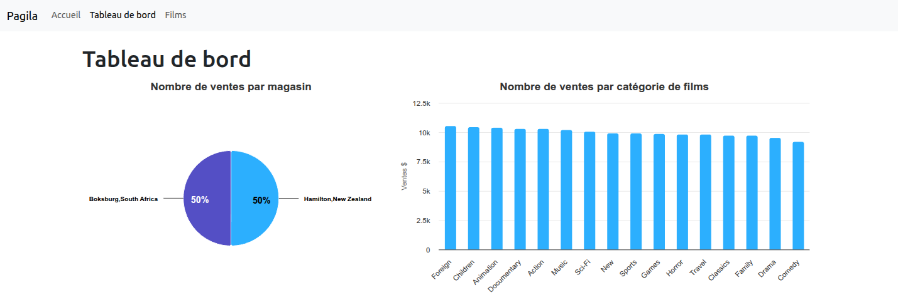
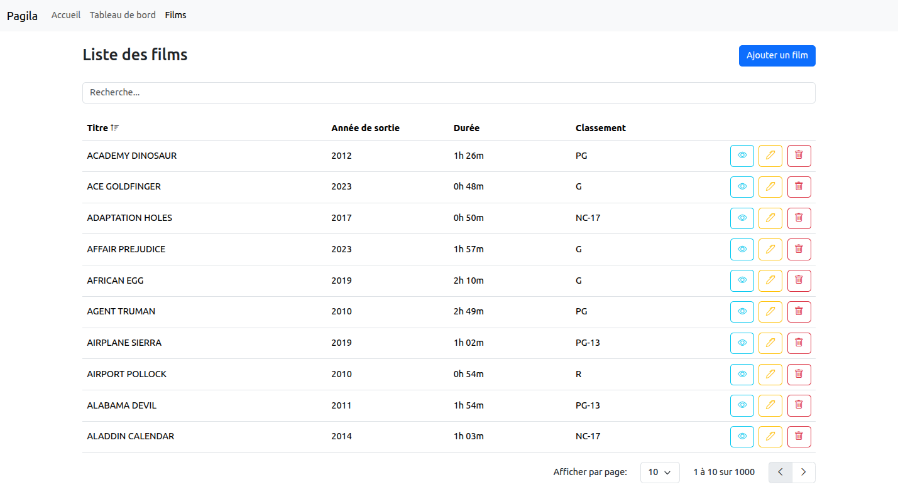
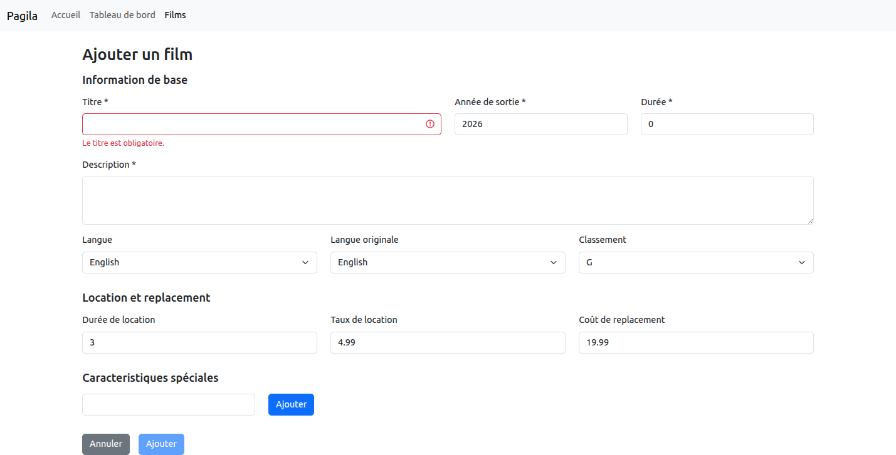

# pagila-client

Client web pour l'application Pagila.

## Fonctionnalités

### Tableau de bord

Statistiques de ventes, telles que le nombre de ventes par magasin et par catégorie de films.

### Gestion de la librairie de films

Liste de films:

- Tri: croissant et décroissant par titre, année de sortie, durée et classement.
- Recherche: filtrage instantané lors de la saisie.
- Pagination: aller à la page suivante et précédente, contrôle du nombre d'éléments à afficher.

Formulaire d'ajout de film: validation côté client des informations.

## Utilisation avec docker

### Mise en marche

Exécuter la commande suivante pour démarrer le conteneur: ``docker compose up --build``

### Arrêt

Exécuter la commande suivante pour démarrer le conteneur: ``docker compose down``
